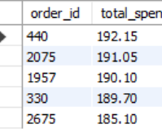
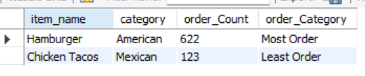

# Restaurant Orders SQL Analysis Project

## Overview
This is a guided SQL project from Maven Analytics where I analyzed restaurant menu and order data to extract business insights.

The project focuses on understanding menu performance, customer ordering behavior, and revenue patterns using SQL.

---

## Project Objectives

This project is divided into three main objectives:

---

## Objective 1: Explore the Items Table

In this section, I explored the `menu_items` table to understand menu composition and pricing.

### Key Tasks:
- Find the total number of items on the menu  
- Identify the least and most expensive items  
- Analyze Italian dishes (count, min, max price)  
- Explore item distribution across categories  
- Calculate average price per category  

SQL file included in repository.

---

## Objective 2: Explore the Orders Table

In this section, I analyzed the `order_details` table to understand ordering behavior over time.

### Key Tasks:
- Identify the date range of orders  
- Count total orders and items ordered  
- Find orders with the highest number of items  
- Identify how many orders had more than 12 items  

SQL file included in repository.

---

## Objective 3: Analyze Customer Behavior

In this section, I combined both tables to understand revenue and customer ordering patterns.

### Key Tasks:
- Combine `menu_items` and `order_details` tables  
- Identify most and least ordered items and their categories  
- Find top 5 highest revenue orders  
- Analyze details of the highest spend order  
- BONUS: Analyze top 5 highest spend orders  

SQL file included in repository.

---
## 📊 Sample Results

### Top 5 Highest Revenue Orders

### Most and Least Ordered Items

## Tools & SQL Concepts Used
- SQL  
- JOINs (INNER JOIN)  
- GROUP BY  
- Aggregations (COUNT, SUM, AVG)  
- Common Table Expressions (CTEs)  
- Window Functions  
- Data analysis and filtering techniques  

---

## Key Learnings
Through this project, I developed a stronger understanding of:

- Structuring SQL queries to answer business questions  
- Using joins to combine relational datasets  
- Aggregating data to generate insights  
- Breaking problems into logical analytical steps  
- Translating raw data into meaningful business insights  

---

## Key Insight
This analysis demonstrates how restaurant data can be used to understand customer behavior, identify high-performing menu items, and evaluate revenue distribution across categories.

---

## Credits
This project is part of the Maven Analytics guided learning track.

---

## Status
Completed ✔

---

## Learning Outcome
Strengthened SQL fundamentals and applied them to a structured business analytics problem.
